# Petros CH32H417W Alef Breakout - Dual RISC-V Core & USB3.0 MCU Board

## 1. Overview

CH32H417 is a 32-bit microcontroller developed by Nanjing Qinheng Microelectronics, designed for embedded product development. It features USB3.0 high-speed interface and dual-core RISC-V architecture. Leveraging these advantages, XPU Labs has launched the Petros CH32H417W Alef development board.

This board adopts the CH32H417WEU6 microcontroller packaged in QFN68 form factor. Measuring 52mm × 21mm, it boasts a compact size and pin-compatible layout with Raspberry Pi RP2040 Pico. Equipped with a USB3.0 Type-A female port, it supports the development of high-speed USB3.0 devices. Actual tests show its downstream transmission speed reaches 430MB/s, making it ideal for high-speed data acquisition. On-board board-to-board connectors bring out DVP, I2C, SPI and ADC interfaces for convenient connection with various sensor modules.

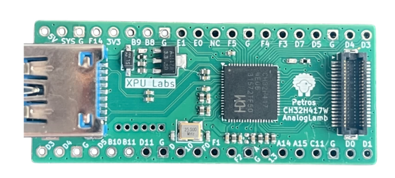

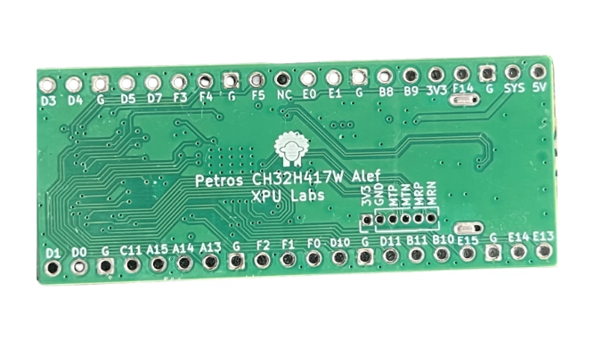

## 2. Chip Features

- Dual-core architecture: Qingke RISC-V5F and RISC-V3F
- V5F maximum frequency: 400MHz, V3F maximum frequency: 144MHz
- 896KB SRAM, 960KB Flash
- System supply voltage: rated 3.3V
- Conventional GPIO supply voltage: rated 3.3V, supports 1.8V
- High-speed GPIO supply voltage: selectable 1.2/1.8/2.5/3.3V
- 2 groups of 16-channel universal DMA controllers
- 2 groups of 12-bit analog-to-digital converters (ADC), sampling rate up to 5Msps, supporting dual ADC conversion mode
- 1 group of 10-bit high-speed analog-to-digital converter (HSADC), sampling rate up to 20Msps
- 16-channel TouchKey detection
- 2 groups of 12-bit digital-to-analog converters (DAC)
- 32-bit wide 125MHz universal high-speed interface (UHSIF)
- 144MHz digital image interface (DVP)
- 200MHz dual-edge SD/EMMC controller (SDMMC)
- SDIO host/slave interface: supports SD/SDIO/MMC
- Single-wire protocol master interface (SWPMI)
- Programmable protocol I/O controller (PIOC)
- Ethernet controller MAC and 10M/100M PHY
- 5Gbps ultra-high-speed USB 3.0 controller and PHY
- 480Mbps high-speed USB 2.0 controller and PHY
- Full-speed USB 2.0 controller and PHY
- Long-distance SerDes controller and PHY, supporting kilovolt-level high-voltage signal isolation transmission
- USB PD and Type-C controller and PHY

## 3. Board Specifications

- Main Chip: CH32H417WEU6, QFN68 package, dual-core RISC-V with USB3.0
- 100% form-factor compatible with Raspberry Pi Pico
- Board-to-board connector supports expansion of camera modules such as OV2640
- All GPIO pins are accessible for convenient development
- DVP, SPI, I2C and ADC interfaces led out via board-to-board connector
- Firmware downloadable via USB3.0 Type-A port
- Built-in SWD and UART debugging interfaces
- Comes with multi-interface Link-E debugger, plug-and-play
- Dimensions: 52mm × 21mm

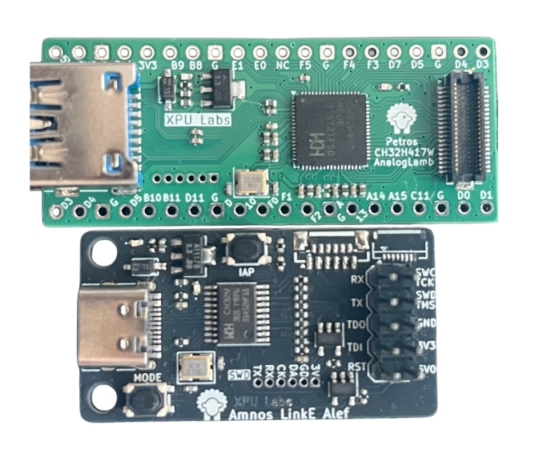

## 4. Hardware

**CH32H417WEQ6 Pin Definitions**

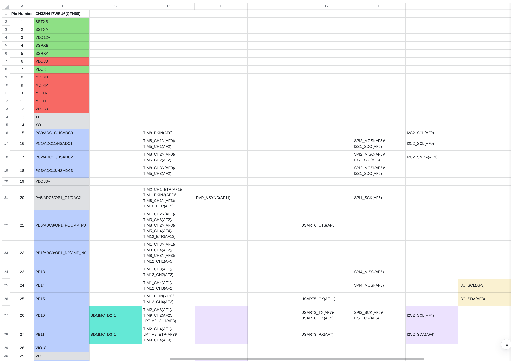

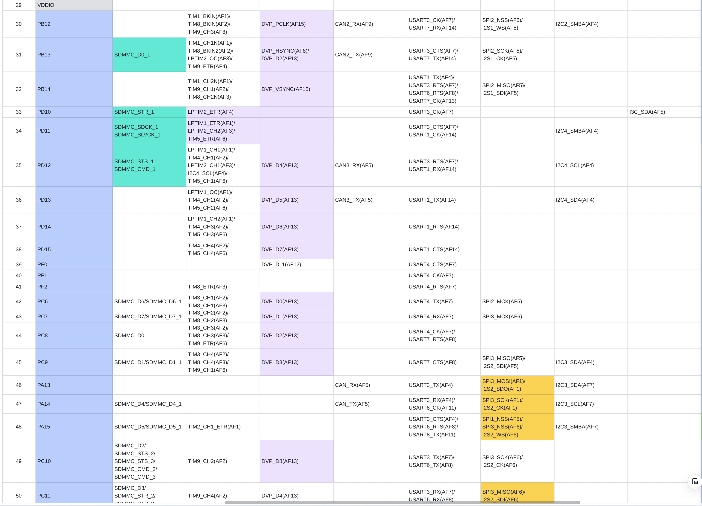

**Interfaces**

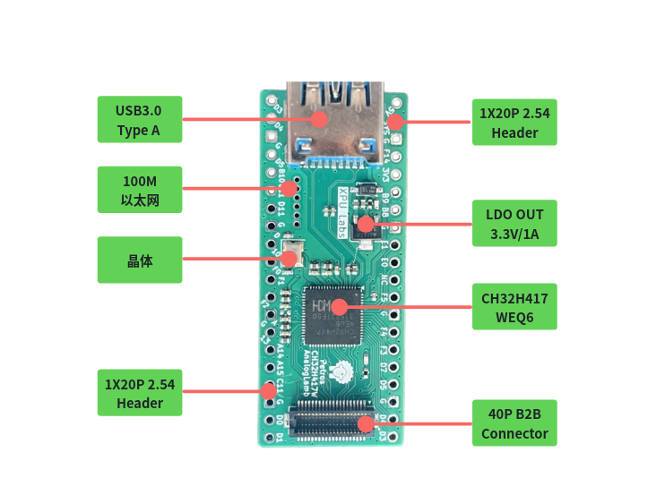

**Pins**

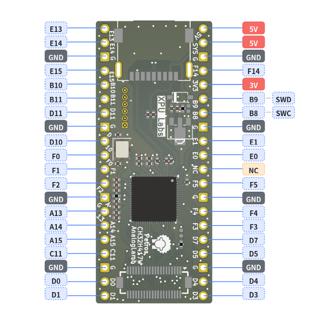

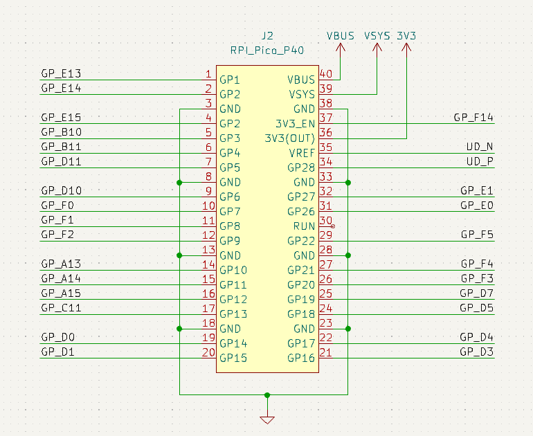

The pin definition of the 40-pin board-to-board connector is as follows. The adopted connector model is HRS **DF12NB(3.0)-40DP-0.5V(51)**.

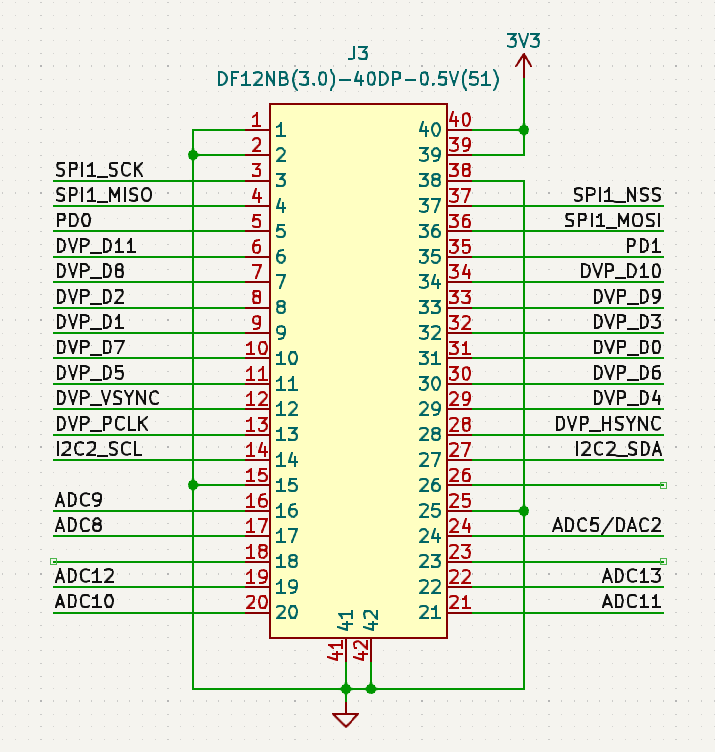

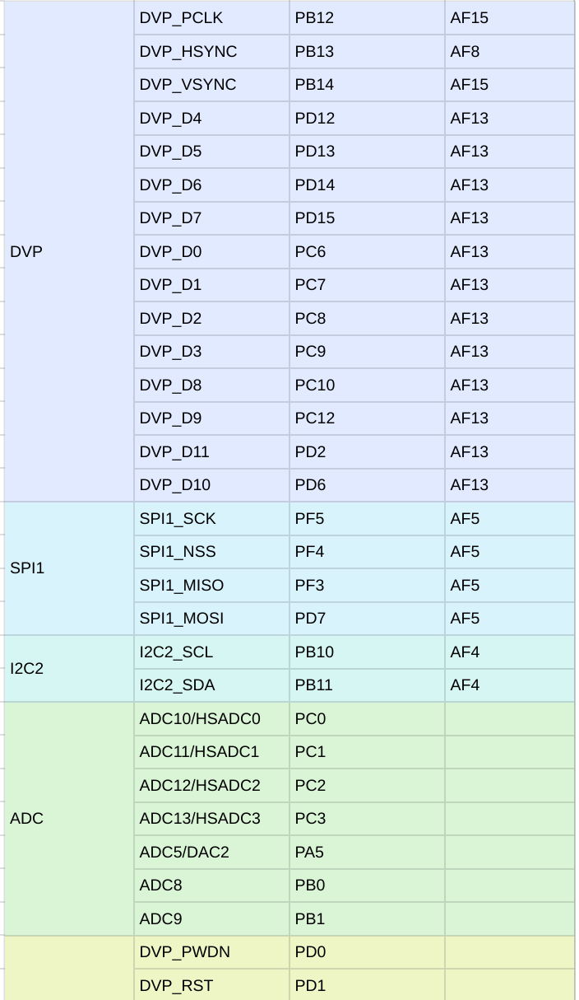

This interface currently supports connection with the Phos Ayin OV2640 module.
  
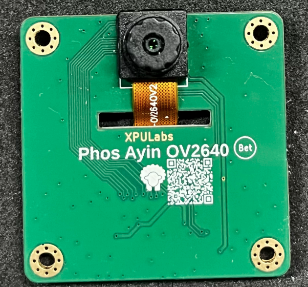
  

## 5. Software

CH32H417M uses MounRiver II IDE for development development. It supports Windows & Linux. 

The debugger is WCH Link-E 1V3, XPU Labs also developed a debugger for this board. It can be directly connected via DuPont wires to the SWD debug interface on pins B8 and B9 (2.54 mm pin header).

Another approach is to use a standard USB2.0 Type‑A port with externally connected pin headers to interface with Link‑E. Simply plug the USB2.0 Type‑A connector into the board’s USB3.0 Type‑A port.

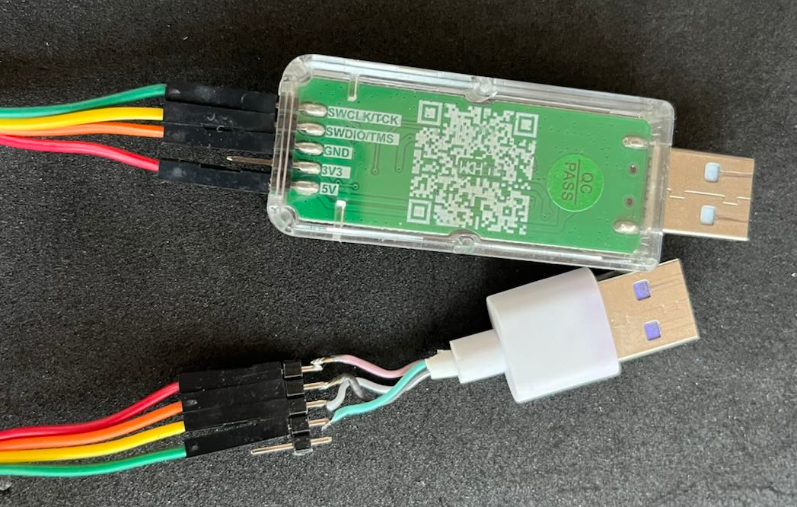

## 6. Tutorials

TBD

## 7. Resources

- **Schematic**
- **CH32H417 SDK**
- **Firmware**

## 8. Examples

TBD

## 9. FAQ

TBD
