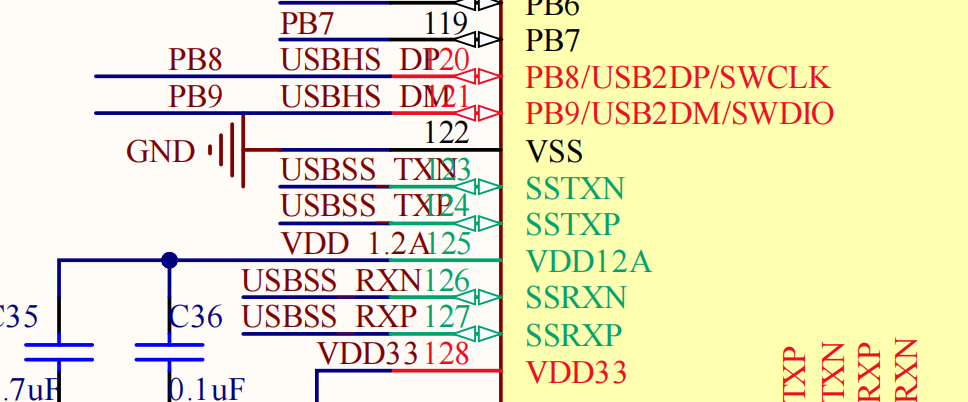
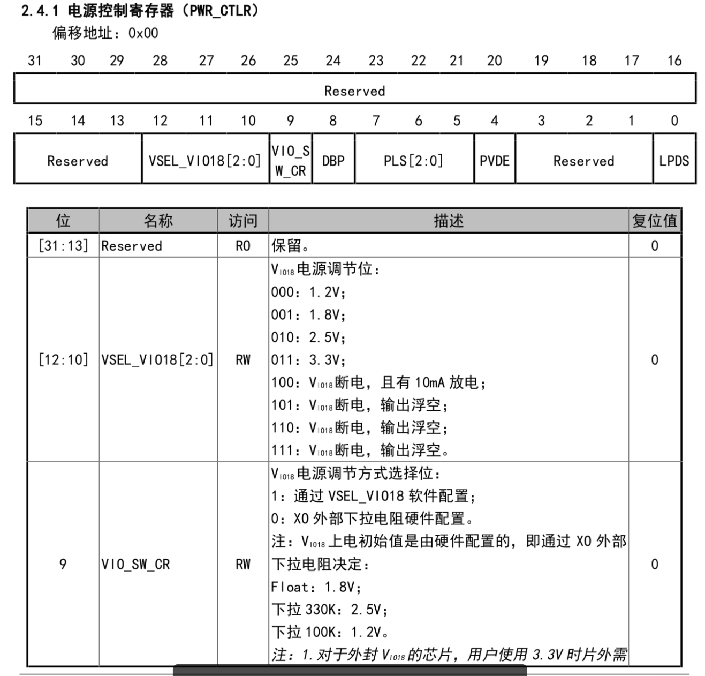

# FAQ

# English Translation
Welcome to the FAQ page for the CH32H417Q development board. This page compiles common‑issue scenarios you may encounter during development, along with corresponding solutions.

Please review the content on this page first. If your issue remains unresolved, you may post a question on the [WCH Official Technical Forum](https://www.wch.cn/bbs/forums/tech.html), where professional technical staff will generally provide replies.

Should you require email‑based support, please send your message to support#xpulabs.com (replace # with @).

Please include the following information in your email:
- Problem description
  - Relevant screenshots (if available)
  - Relevant logs (if available)
- Development environment (e.g. MounRiver Studio II IDE)
- Relevant code (if available)


## Q0001 - How to buy XPU Labs Boards?

Please visit [AnalogLamb](https://www.analoglamb.com) to buy XPU Labs boards.


## Q0002 - How to download CH32H417 SDK?

You may download the SDK for the CH32H417Q development board from the official WCH website.

Visit the links below to obtain the latest SDK version and technical manuals:

- [WCH CH32H417Q SDK](https://www.wch.cn/downloads/CH32H417EVT_ZIP.html)
- [WCH CH32H417Q Technical Manual](https://www.wch.cn/downloads/CH32H417RM_PDF.html)

MounRiver Studio II is recommended as the development environment, as it offers full‑fledged support for the CH32H417Q development board.

- [MounRiver Studio II IDE](https://www.mounriver.com/download.html)

## Q0003 - Firmware Download Always Fails on the Development Board for the First Time


After receiving the board, you attempt to flash an LED‑blinking program, yet the flashing process fails no matter what you do. What causes this issue?

This happens because a USB3.0 test program is pre‑flashed on the board. This program disables the SWD interface. PB8 and PB9 (SWDIO, SWCLK) are multiplexed with the HS D+/D‑ signals of the USB3.0 interface.

Accordingly, the SWD interface gets disabled by the following code during the initialization of the USB3.0 program.



```C
    /* Disable SWD */
    RCC_HB2PeriphClockCmd(RCC_HB2Periph_AFIO | RCC_HB2Periph_GPIOB, ENABLE);
    GPIO_PinRemapConfig(GPIO_Remap_SWJ_Disable, ENABLE);
```

Solution: Erase the Code Flash using the WCH‑LINK‑E debugger.
The detailed steps are as follows:

1. Connect the WCH‑LINK‑E debugger to the SWD interface of the development board, and power the board via the debugger.
2. Launch MounRiver Studio II IDE, go to **Download** → **Download Configuration**.
3. For the **Erase Code Flash** option, select **By Power off**, then click **Apply**. A success message will pop up in the dialogue box below.
   
   

4. Unplug the WCH‑LINK‑E debugger to power off the development board, then reconnect the debugger to power the board back on.
5. Flash the firmware again using MounRiver Studio II IDE; the operation should now succeed.

## Q0004 - Why is the GPIO level incorrect?

The CH32H417 integrates an internally‑regulated LDO with adjustable output voltage to supply power to the VIO_18 net. A 100 K pull‑down resistor on the XO pin yields a 1.2 V output; a floating XO pin yields a 1.8 V output; and a 330 K pull‑down resistor yields a 2.5 V output.




The output voltage of the LDO can be configured via software. The specific procedure is as follows:

```C
    RCC_HB1PeriphClockCmd(RCC_HB1Periph_PWR, ENABLE);
    PWR_VIO18ModeCfg(PWR_VIO18CFGMODE_SW);
    PWR_VIO18LevelCfg(PWR_VIO18Level_MODE3); // output 3.3V
```

## Q0005 - Why does the USB2.0 HS interface fail to work properly?

The PB8 and PB9 pins for the SWD interface are multiplexed with the D+/D‑ signals of the USB2.0 HS interface. You need to disconnect the LINK‑E debugger, after which normal initialization will take place. If the LINK‑E debugger remains connected, an unknown USB device will be displayed on the host.