# WCH CH32V4x7 EVB User Guide

## 1. Overview

This evaluation board is applied to the development of the CH32V4x7 chip. The IDE uses the MounRiver 2 compiler, with the option of WCH-Link for emulation and download, and provides reference examples and demonstrations of applications related to chip resources.。

## 2. Evaluation Board Hardware

Please refer to the CH32V4x7SCH.pdf document for the schematic of the evaluation board.

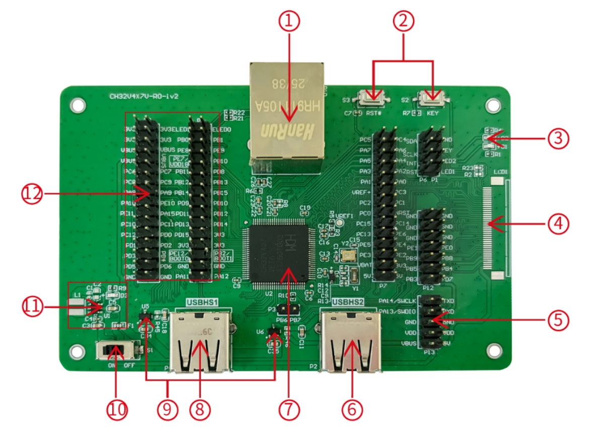

**Module Description**

- 1. Network port
- 2. Button 
- 3. LED 
- 4. LCD interface
- 5. SWD interface
- 6. USBHS2 interface
- 7. Main control MCU
- 8. USBHS1 interface
- 9. Low voltage drop ideal diode
- 10. Power switch
- 11. DCDC circuit
- 12. IO port

The above CH32V407VET6 evaluation board comes with the following resources. Motherboard - CH32V4x7V-R0

1. Network port: The main chip's network communication interface
2. USER button and reset button: Connect to the main MCU's I/O ports for button control and external manual reset of the main MCU.
3. LED: Controlled via pins connected to the main MCU's I/O ports
4. LCD interface: Used for expanding the display screen
5. SWD interface: Used for download and debugging
6. USBHS2 interface: Connects to the main chip's USBHS2 communication port
7. Main control MCU: The main controller chip is CH32V407VET6
8. USBHS1 interface: Connects to the main chip's USBHS1 communication port
9. Low voltage drop ideal diode: used for upstream USB power providing over-current and short-circuit protection.CH213 is a low-dropout ideal diode chip with current limiting capability
10. Power switch: Used to disconnect or connect external 5V power supply or USB power supply
11. DC-DC circuit: The buck converter chip is CH2003V, used to convert 5V voltage to 3.3V voltage usable by the chip
12. MCU I/O ports: I/O pin-out interface of the main MCU

## 3. Software Development

### 3.1 EVT Package Directory Structure

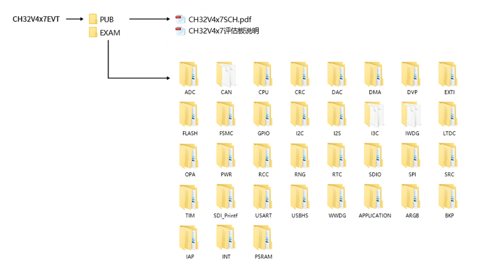

PUB folder: provides evaluation board manuals, evaluation board schematics.
EXAM folder: Provides software development drivers and corresponding examples for the CH32V4x7 controller, grouped by peripheral. Each type of peripheral folder contains one or more functional application routines folders.

### 3.2 IDE Use-MounRiver

Download MounRiver_Studio, double click to install it, and you can use it after installation. (MounRiver_Studio instructions are available at the path: MounRiver\MounRiver_Studio\ MounRiver_Help.pdf and MounRiver_ToolbarHelp.pdf)

**Open Project**

1）Double-click project file directly with the suffix name .wvproj under the corresponding project path.
2）Click File in MounRiver IDE2, click Load Project, select the .project file under the corresponding path, and click Confirm to apply it.

**Compilation**

MounRiver contains 3 compilation options, as shown in the following figure.

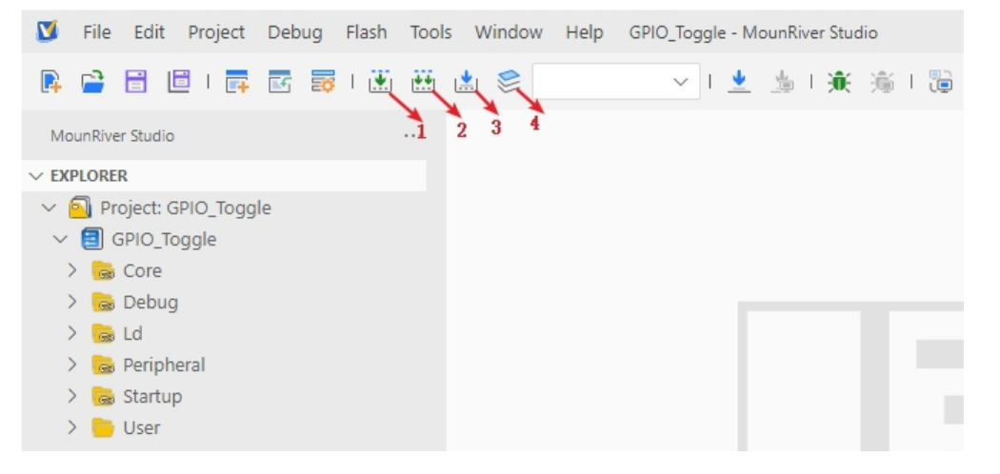

- Compilation option 1 is Incremental Build, which compiles the modified parts of the selected project.
- Compilation option 2 is ReBuild, which performs a global compilation of the selected project.
- Compilation option 3 is incremental compilation and download, which compiles the modified part of the selected project and then downloads it;
- Compilation option 4 is All Build, which performs global compilation for all projects.

**Download**

Connect to the hardware via WCH-Link (see WCH-Link instructions for details, path: MounRiver\MounRiver_Studio\ WCH-Link instructions.pdf), click the Download button on the IDE, and select Download in the pop-up interface, as shown in the figure below.

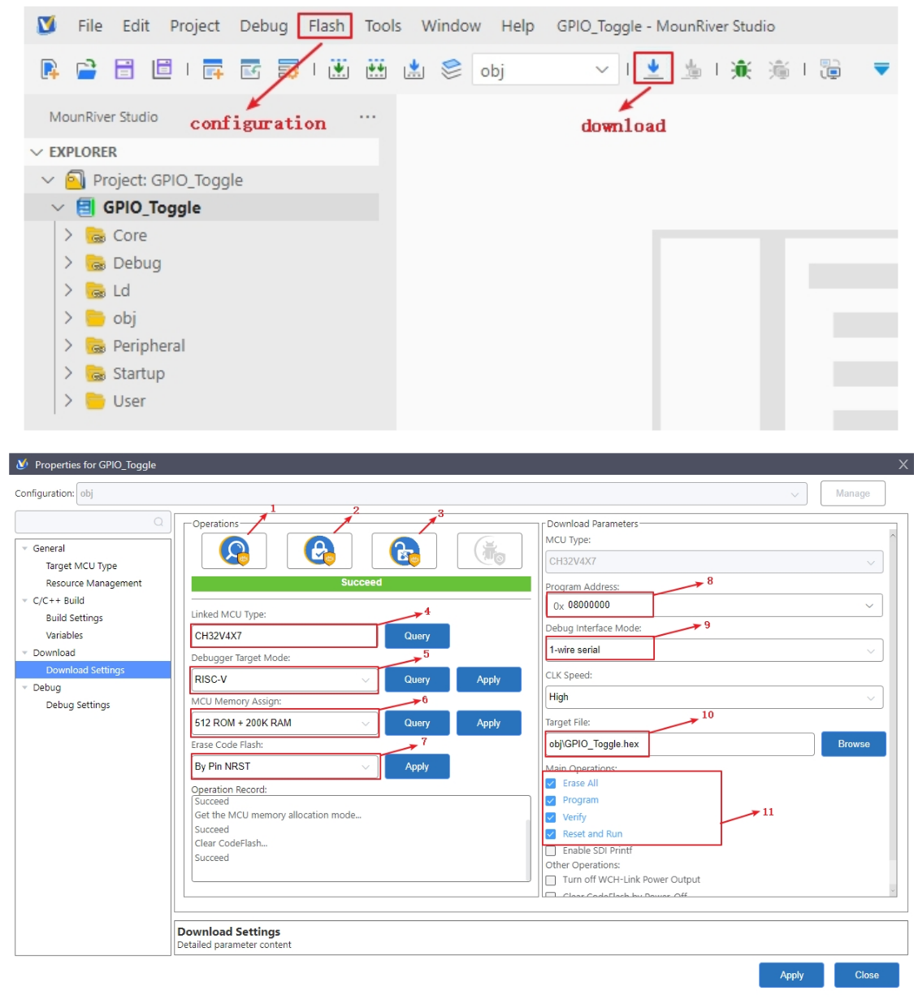

- 1-for querying the chip read protection status;
- 2-for setting the chip read protection, re-power on the configuration to take effect;
- 3-for lifting the chip read protection, re-power on the configuration to take effect;
- 4-for query the display of the current chip type
- 5-for setting the LINK mode
- 6-for setting the FLASH, RAM configuration
- 7-power-off to erase the whole user area flash
- 8-for setting the download address
- 9-for selecting the single and dual line mode
- 10-for selecting the download file
- 11-for download the configuration options

**Simulation**

Open MounRiver Studio software for debugging configuration

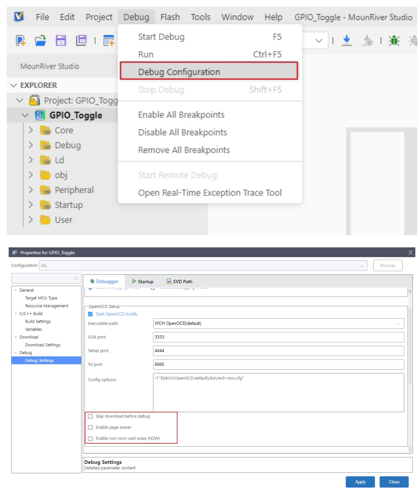

Select the appropriate debugging options, and apply and save the settings.

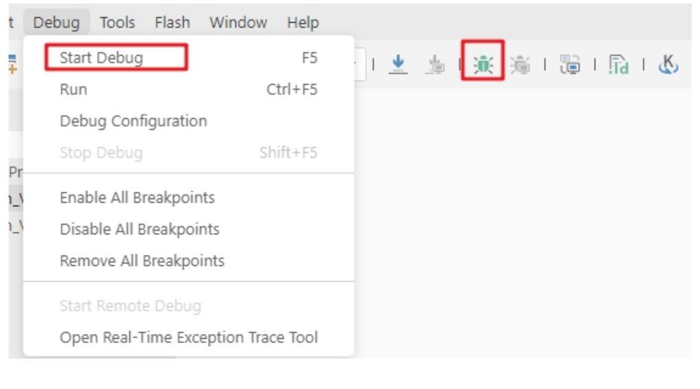

Click Start Debug or debug icon to start debugging.

**1）Toolbar description**

Click Debug button in the menu bar to enter the download, see the image below, the download toolbar.

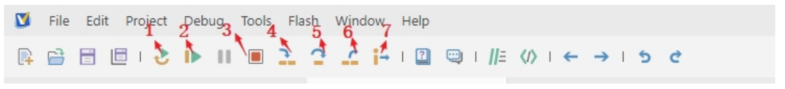

Detailed functions are as follows：

- 1. Reset: After reset, the program returns to the very beginning.
- 2. Continue: Click to continue debugging.
- 3. Terminate: Click to exit debugging.
- 4. Single-step jump-in: Each time you tap a key, the program runs one step and encounters a function to enter and execute.
- 5. Single-step skip: jump out of the function and prepare the next statement.
- 6. Single-step return: return the function you jumped into
- 7. Instruction set single-step mode: click to enter instruction set debugging (need to use with 4, 5 and 6 functions).

**2）Set breakpoints**

Double-click on the left side of the code to set a breakpoint, double click again to cancel the breakpoint, set the breakpoint as shown in the following figure;

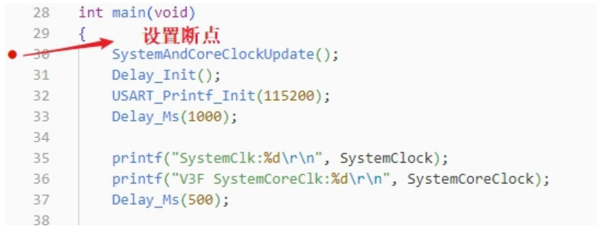

**3）Interface display**

1. Instruction set interface
Click on the instruction set single-step debugging can enter the instruction debugging, to single-step jump in for example, click once to run once, the running cursor will move to view the program running, the instruction set interface is shown as follows.

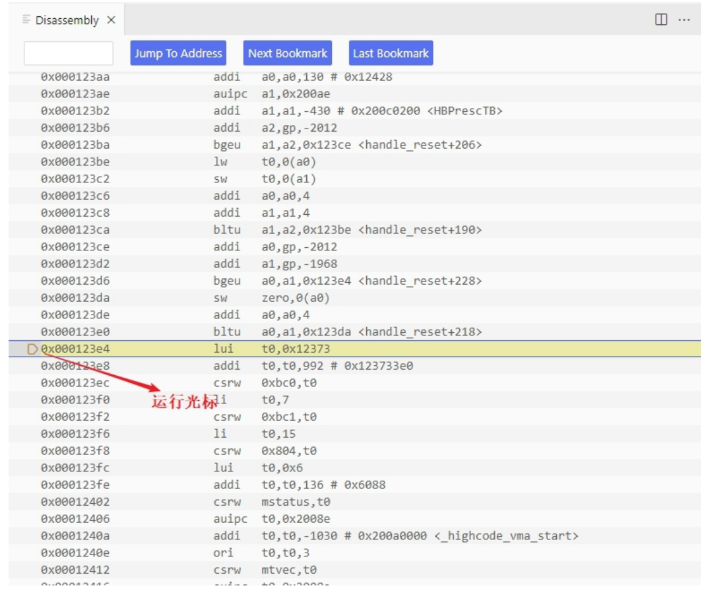

2. Program running interface
It can be used with instruction set single-step debugging, still take single-step jumping in as an example, click once to run once, the running cursor will move to view the program running, the program running interface is shown as follows.

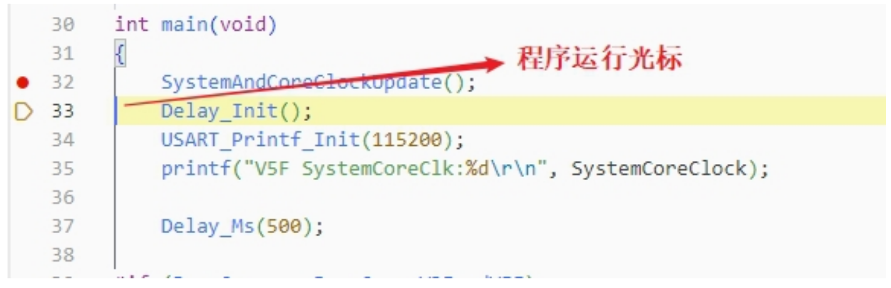

**4）Variables**

Hover over the variable in the source code to display the details, or select the variable and right-click add to watch

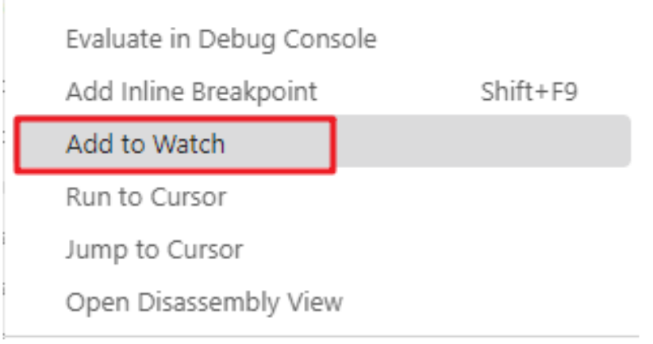

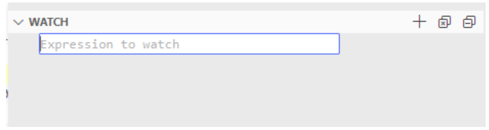

Fill in the variable name , and add the variable you just selected to the window:

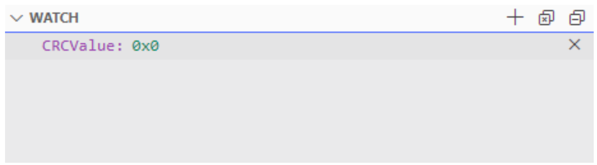

**5）Peripheral registers**

In the lower left corner of IDE interface Peripherals interface shows a list of peripherals, tick the peripherals will display its specific register name, address, value in the Memory window.

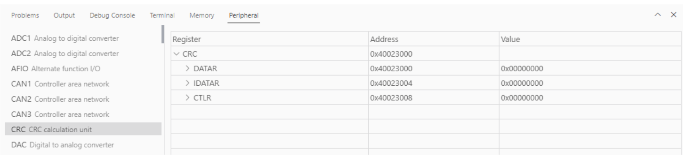

Tips：When debugging, click the icon in the upper right corner to enter the original interface.

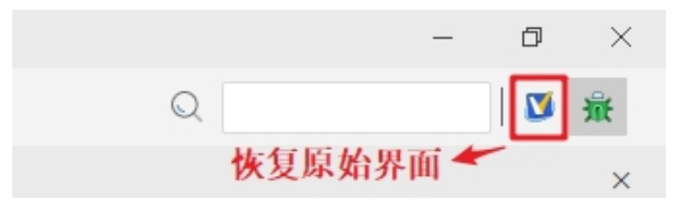

## 4. WCH-LinkUtility.exe Download

The download process for the chip using the WCH-LinkUtility tool is:

- 1）Connect WCH-Link
- 2）Select chip information
- 3）Add firmware
- 4）If the chip is read protected, you need to release the chip read protection.
- 5）Execute

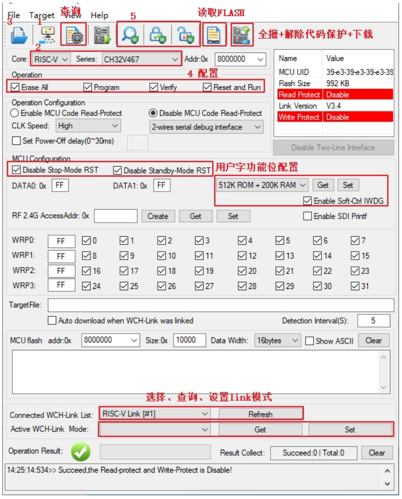

## 5. WCHISPTool.exe Download

Use the WCHISPTool to download the chip, supporting both USB and serial port download methods. USB pins are PA11 (USB1DM), PA12 (USB1DP), PB6 (USB2DM), and PB7 (USB2DP); serial port pins are PA9 (TX) and PA10 (RX). The LQFP64 package does not support the BOOT function. Specific chip models include CH32V407RET6 and CH32V467RET6. 

The download process is as follows:

- Connect BOOT0 to VCC and BOOT1 to ground. Connect to a PC via serial port or USB
- Open the WCHISPTool utility. Select the appropriate download method, choose the firmware to download, check the chip configuration, and click Download.
- Connect BOOT0 to ground, power cycle the device, and run the application program.

The WCHISPTool interface is shown in the figure below:

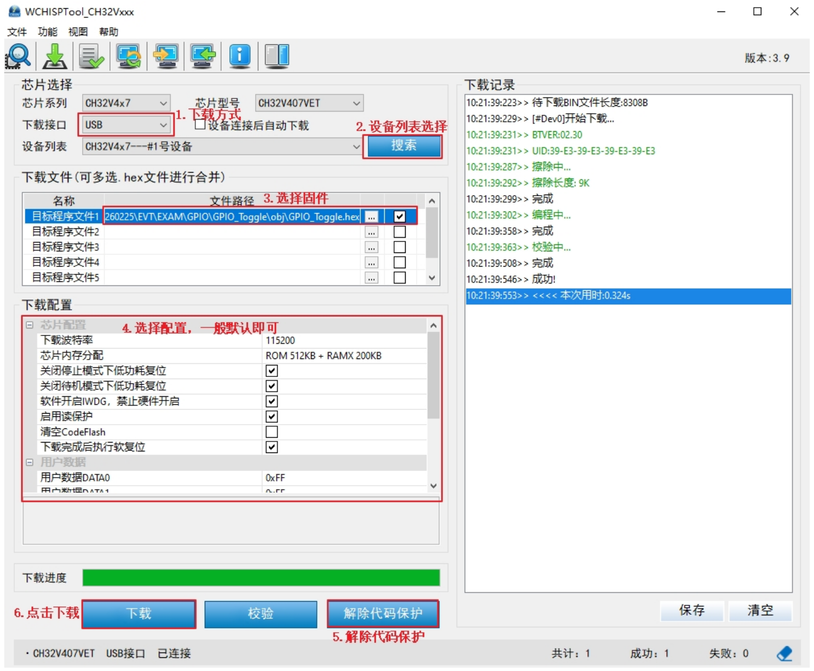

- 1. Select USB or serial port download method;
- 2. Select device from the list; the device will typically be recognized automatically. If not recognized, manual selection is required.
- 3. Select the firmware; choose the downloaded .hex or .bin target program file;
- 4. Select the download configuration as required;
- 5. Remove code protection
- 6. Click Download.

## 6. Resources

- SDK

- Schematic

- Purchase：[www.analoglamb.com](https://www.analoglamb.com)        
