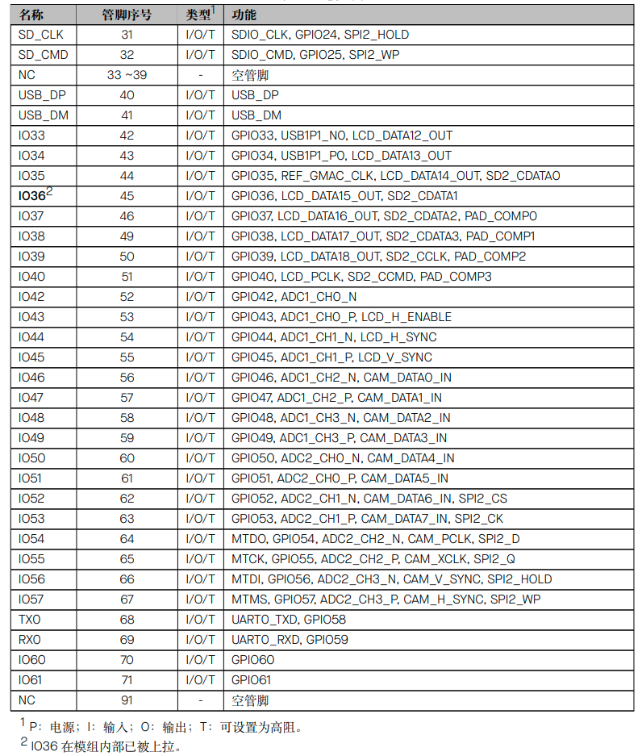
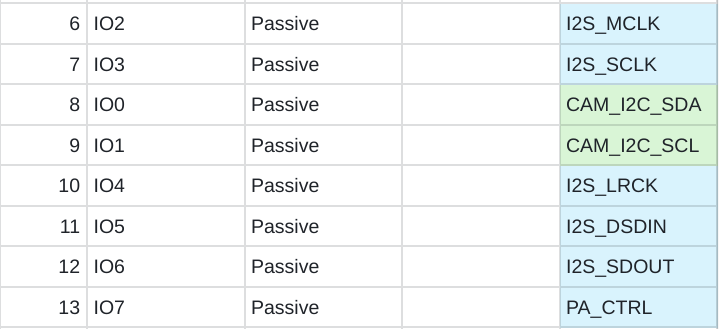
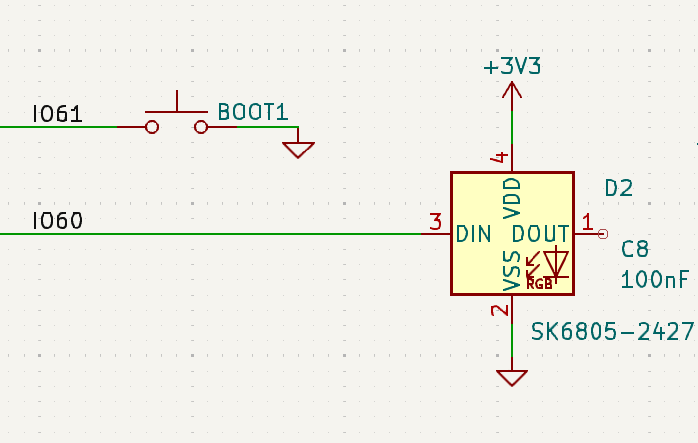

# Maple ESP32S31 Alef Development Board User Guide

## 1. Board Overview


The Maple ESP32‑S31 Alef Development Board is designed by XPU Labs. It is a high‑performance entry‑level board for IoT enthusiasts, makers and embedded‑system beginners. Equipped with the latest ESP32‑S31 chip and abundant peripherals, it enables zero‑threshold development for wireless communication and smart‑hardware projects.

---

**🔥 Key Highlights**

- **Dual‑core RISC‑V @ 320 MHz**: Powered by the Espressif ESP32‑S31 chip, featuring a 32‑bit dual‑core RISC‑V processor clocked at up to 320 MHz. It delivers robust performance to handle complex tasks effortlessly.

- **Generous Memory**: 512 KB SRAM + **16 MB PSRAM** + **16 MB Flash**, capable of running large‑scale programs, image buffering and audio processing with ease.

- **Wi‑Fi 6 + Bluetooth 5.4 + Zigbee/Thread**: Supports concurrent operation of the latest 2.4 GHz Wi‑Fi 6 (802.11ax), Bluetooth 5.4 LE/Classic, Zigbee and Thread protocols, covering full‑scale scenarios for smart home and industrial connectivity.

- **ULP‑RISC‑V Co‑processor**: Processes sensor data even in ultra‑low‑power standby mode, ideal for battery‑powered projects.

📦 **Rich Peripherals, Plug‑and‑Play**

| Interface / Feature         | Description                                                                      |
| --------------------------- | -------------------------------------------------------------------------------- |
| **USB 2.0 Host** ×1         | Directly connect mice, keyboards and USB flash drives for expanded possibilities |
| **SPI LCD Interface**       | Drives TFT colour displays for dashboards and game UIs                           |
| **I2C / I2S / DVP**         | For sensors, audio modules and cameras (e.g. OV2640)                             |
| **SD Card Slot (SDIO Bus)** | High‑capacity storage for logs and media files                                   |
| **CH343P USB‑UART**         | Auto‑download circuitry; one‑cable Type‑C flashing with no manual reset required |
| **Single‑wire RGB LED**     | Status indication and ambient lighting, developer‑friendly for programming       |
| **EN + BOOT Buttons**       | One‑click operations for debugging and firmware upgrades                         |
| **1×20‑Pin Header ×2**      | All GPIOs broken out; compatible with breadboards and expansion shields          |

**📐 Compact Form Factor**

- **Dimensions: 67 × 28 mm**, smaller than a credit card, for direct integration into prototypes or enclosures.

- On‑board antenna delivers stable wireless signals with no external antenna needed.

**🚀 Ready‑to‑Start Experience**

- Compatible with mainstream development environments including **Arduino IDE**, **ESP‑IDF** and **MicroPython**.

- Complete getting‑started guides, sample codes and schematic documents are provided.

- Community support available via Feishu groups, forums and Bilibili video tutorials for troubleshooting.

**🎯 Target Users**

- **Electronics Enthusiasts**: Learn RISC‑V architecture, Wi‑Fi 6 and multi‑protocol communication.

- **Makers / Geeks**: Build smart‑home gateways, portable meters and desktop robots.

- **Embedded‑System Beginners**: Progress from basic LED blinking to full IoT projects with one board and supporting documentation.

---

**Product of XPU Labs** — Dedicated to building cost‑effective, beginner‑friendly learning and prototyping platforms for developers.

👉 [Go to AnalogLamb, Buy it Now](https://www.analoglamb.com)

## 2. Chip Features

The ESP32‑S31 is a high‑performance dual‑core 32‑bit RISC‑V microcontroller with a maximum clock frequency of 320 MHz. Optimized for full multi‑protocol connectivity, it is designed for advanced Internet of Things (IoT) applications requiring comprehensive connectivity and rich human‑machine interfaces. The chip provides 60 GPIOs, delivering outstanding flexibility for complex designs supporting multiple wireless protocols, various display interfaces and diverse peripherals simultaneously. The ESP32‑S31 is particularly suitable for edge‑side AI and machine‑learning workloads, including neural‑network inference, advanced signal processing, computer vision and intelligent audio applications, while retaining the high‑efficiency characteristics of embedded platforms.


The functional block diagram of the chip is shown in the figure below.


## 3. Board Specifications

- **Adopts the ESP32‑S31‑WROOM3 module**: Integrates the ESP32‑S31 chip, a 32‑bit dual‑core RISC‑V microprocessor supporting clock frequencies up to 320 MHz

- Equipped with a ULP‑RISC‑V co‑processor, 320 KB ROM, 512 KB shared SRAM, **16 MB PSRAM and 16 MB Flash**

- Supports multiple wireless protocols including 2.4 GHz Wi‑Fi 6, Bluetooth® 5.4 (LE), Bluetooth® Classic, Zigbee and Thread (802.15.4)

- CH343P USB‑to‑UART chip with auto‑download circuitry

- 1 × USB 2.0 Host interface

- I2C, I2S & DVP interfaces for expanding audio and camera modules

- SPI LCD interface for connecting TFT LCD displays

- 1 × single‑wire full‑color RGB LED

- SD‑card interface via SDIO bus

- EN & BOOT buttons for convenient debugging

- 1×20‑pin headers on both sides for great expandability

- Board dimensions: 67 × 28 mm

## 4. Hardware Development

### ESP32-S31-WROOM3

The ESP32‑S31‑WROOM‑3 is a general‑purpose MCU module supporting Wi‑Fi, Bluetooth® 5.4 (LE), Bluetooth® Classic and IEEE 802.15.4. It features powerful performance and abundant peripheral interfaces, and can be applied to IoT scenarios such as embedded systems, smart homes and wearable electronic devices. The ESP32‑S31‑WROOM‑3 adopts an on‑board PCB antenna.




### Interface

**HW Diagram**


**Interface**


### Pin Map

**Audio & Camera**




**SD Card**


**USB Host**


**SPI LCD Display**


**RGB LED**



**1X20P Headers**


## 5. Software Development

The core of this board is the **ESP32‑S31‑WROOM‑3 module** (16 MB Quad SPI Flash + 16 MB Octal SPI PSRAM, on‑board PCB antenna). The ESP32‑S31 chip itself features a dual‑core RISC‑V running at 320 MHz, and rich peripherals including USB 2.0 HS OTG, SDMMC, LCD_CAM, I2S, TWAI, etc. All these peripherals are already supported on the ESP‑IDF master branch.


The overall software‑development workflow is: **Set up the ESP‑IDF environment correctly (master + preview mandatory) → Get `hello_world` running → Add features module‑by‑module by peripheral**. The following sections walk through this workflow.

### 5.1 Development Environment: ESP‑IDF master is mandatory

ESP32‑S31 currently receives **preview‑level support exclusively on the ESP‑IDF master branch**. Pre‑release support starts from v6.1‑beta1, with the stable release expected to be v6.1.1. Using release/v5.x will directly throw the error `unknown target esp32s31`.
**Installation (EIM command‑line is recommended)**

```bash
# 1. Clone master branch
git clone -b master --recursive https://github.com/espressif/esp-idf.git ~/esp/esp-idf-master
cd ~/esp/esp-idf-master
# 2. Install toolchain (esp32s31‑only)
./install.sh esp32s31
# 3. Activate environment
. ./export.sh
```

Windows users can use the EIM GUI or run `eim wizard` interactively inside PowerShell, then select the ESP32‑S31 chip.
**Project Creation**

```bash
idf.py create-project my_s31_app && cd my_s31_app
# ⚠️ --preview flag is mandatory; otherwise code generation for ESP32 will fail
idf.py --preview set-target esp32s31
idf.py build
idf.py --preview -p /dev/ttyUSB0 flash monitor # Linux
idf.py --preview -p COM3 flash monitor # Windows
```

This board features **CH343P plus auto‑download circuitry**. Normally you can flash directly with `idf.py flash` without manually pressing the BOOT button. If the serial port cannot be detected, press EN to perform a hardware reset. If necessary, hold BOOT while power‑cycling to enter download mode.

### 5.2 Critical `menuconfig` Settings

```bash
idf.py menuconfig
```

For this board with 16 MB Flash + 16 MB PSRAM, the following configurations must be modified:


| Config Path                                       | Recommended Value       | Notes                                                                                                                                                                                                                                                            |
| ------------------------------------------------- | ----------------------- | ---------------------------------------------------------------------------------------------------------------------------------------------------------------------------------------------------------------------------------------------------------------- |
| **Component config → ESP32‑S31 Specific → PSRAM** | Enable Octal PSRAM      | For 16 MB Octal SPI PSRAM                                                                                                                                                                                                                                        |
| **Serial flasher config → Flash size**            | 16 MB                   | Matches the module specification                                                                                                                                                                                                                                 |
| **Partition Table**                               | Custom or Factory 12MB+ | Reasonable partitioning required for 16 MB Flash                                                                                                                                                                                                                 |
| **Component config → FreeRTOS**                   | Dual‑core scheduling    | For dual‑core RISC‑V operation
After PSRAM is enabled, large memory blocks marked with `MALLOC_CAP_SPIRAM` in application code will automatically be allocated to PSRAM. This is critical for LCD frame buffers, audio buffers and AI‑model inference workloads. |

### 5.3 Modular Peripheral‑Driven Development

Drawing on bring‑up experience for official boards such as the ESP32‑S31‑Korvo‑1, it is recommended to add features in the following sequence:
**Basics: Hello World + GPIO + RGB LED**
The single‑wire full‑color RGB LED is typically driven via the RMT peripheral implementing the WS2812 protocol:

```bash
# Reference Korvo‑1 WS2812 example (GPIO37)
idf.py --preview set-target esp32s31
```

Always refer to **your board’s schematic / silkscreen markings for exact GPIO assignments**. No publicly available pinout exists for this exact board, so do not blindly reuse GPIO37 values from the Korvo‑1 reference design.
**SPI LCD (key peripheral for this board)**
Full driver support for the **SPI LCD driver** is available on ESP‑IDF master. A 240×240 ST7789 display example was covered in an earlier discussion. General workflow:

- Use the `esp_lcd` component alongside `esp_lcd_st7789`
- Select ST7789 as the display controller inside `menuconfig`
- Assign SCLK/MOSI/DC/RST/CS pin numbers in code (**consult your board schematic**)
- Place RGB565 frame buffers inside PSRAM where possible

**SDIO SD Card**

The ESP32‑S31 **SDMMC Host driver supports UHS‑I**, and SDSPI is also available. In 1‑bit mode, minimum required connections are CLK / CMD / D0 plus pull‑up resistors. Refer to the calling sequence for `sdmmc_host_init_slot()` mentioned earlier. The null‑pointer assert fault originates from incorrect initialization ordering specific to the master branch.

**USB 2.0 Host**

The ESP32‑S31 **USB Host driver implements USB 2.0 Host functionality**. The on‑board USB Host connector can accept mice, keyboards, USB flash drives, USB audio devices and more. For development, use TinyUSB host‑mode sample code:

bash

```
# Locate USB‑related examples under esp‑idf/examples/peripheral/usb
```

**Wireless Protocol Stacks**

This is a key strength of ESP32‑S31. **Wi‑Fi 6, Bluetooth 5.4 (LE + Classic), 802.15.4 (Zigbee / Thread / Matter)** are all supported on master:

- **Wi‑Fi**: `examples/wifi` includes getting‑started, scan, station and other demos
- **BLE**: `examples/bluetooth/nimble` or Bluedroid stacks
- **Classic BT A2DP**: Refer to the Korvo‑1 A2DP Sink sample
- **Zigbee / Thread / Matter**: Use the ESP‑Matter SDK (built upon ESP‑IDF master)

**I2C / I2S / DVP**

- I2C: Both master and slave drivers are supported
- I2S: STD / TDM / PDM modes available for audio encoding and decoding
- DVP Camera: LCD_CAM DVP interface is fully supported

### 5.4 Recommended Development Roadmap

plaintext

```
Week 1: Environment setup + hello world + GPIO LED blinking
Week 2: Bring‑up SPI LCD (provides immediate visual feedback)
Week 3: Basic Wi‑Fi / BLE communication
Week 4: SD‑card read‑write + large PSRAM buffers
Week 5: USB Host peripheral integration
Week 6: End‑to‑end integrated application (example: USB camera → PSRAM → LCD display)
```


## 6. Tutorials

TBD

## 7. Resources

- [ESP32-S31-WROOM-3 Datasheet](https://documentation.espressif.com/esp32-s31-wroom-3_datasheet_en.pdf)

- [ESP32-S31 Chip Datasheet](https://documentation.espressif.com/esp32-s31_datasheet_en.pdf)

- [ESP32-S31 Docs](https://esp32-s31.espressif.com/en/docs)

## 8. Examples

- LED Blink

- SPI LCD Display

- SD Card Test

## 9. FAQ

TBD
